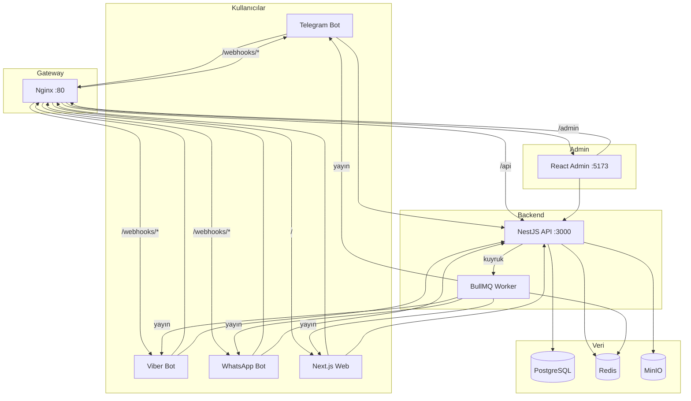
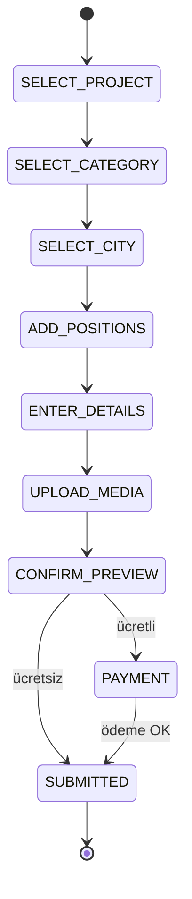
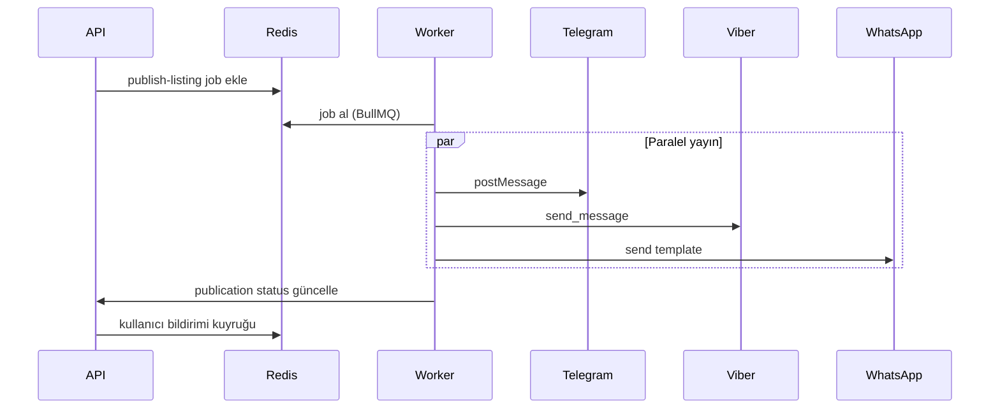

# İlanHub — Sistem Mimarisi

> Ukrayna pazarı için çok kanallı ilan platformu. Monorepo: pnpm + Turborepo + TypeScript.

---

## 1. Sistem Genel Bakış

İlanHub, kullanıcıların Telegram, Viber, WhatsApp veya web üzerinden ilan vermesini; moderatörlerin admin panelinden onaylamasını; onay sonrası tüm aktif kanallara otomatik yayınlanmasını sağlayan dağıtık bir sistemdir.



---

## 2. Servisler ve Portlar

| Servis | Port | Görev |
|--------|------|-------|
| **nginx** | 80 (prod: 443) | Reverse proxy, SSL sonlandırma |
| **api** | 3000 | REST API, ödeme webhook'ları, moderasyon |
| **bot-telegram** | 3001 | Grammy webhook sunucusu, ilan verme state machine |
| **bot-viber** | 3002 | Viber REST API webhook, ilan verme |
| **bot-whatsapp** | 3003 | Meta Cloud API webhook, ilan verme |
| **web** | 3004 | Next.js 15 public site, ilan wizard |
| **admin** | 5173 | React moderatör paneli |
| **worker** | — | BullMQ publication kuyruğu işleyicisi |
| **postgres** | 5432 | Ana veritabanı (Drizzle ORM) |
| **redis** | 6379 | Session, cache, BullMQ kuyruk |
| **minio** | 9000/9001 | Medya depolama (S3 uyumlu) |

### Nginx Yönlendirme

| Path | Hedef |
|------|-------|
| `/api/*` | `api:3000` |
| `/admin/*` | `admin:5173` |
| `/webhooks/telegram` | `bot-telegram:3001/webhook` |
| `/webhooks/viber` | `bot-viber:3002/webhook` |
| `/webhooks/whatsapp` | `bot-whatsapp:3003/webhook` |
| `/*` | `web:3004` |

---

## 3. Uçtan Uca Akış

### 3.1 Admin Kurulumu

1. Admin panelde **Proje** oluşturulur (slug: `horeca`, `jobs`, `auto`)
2. Proje için **kategoriler** ve **şehirler** tanımlanır
3. **Kanal yapılandırması**: ilan verme + yayın kanalları aktifleştirilir
4. Bot token'ları ve kanal ID'leri girilir (Telegram, Viber, WhatsApp)
5. **Fiyat planı** ve ödeme yöntemleri ayarlanır (Monopay, LiqPay, havale)
6. Moderatörler atanır

### 3.2 İlan Verme (Bot / Web)

1. Kullanıcı `/start` veya web `/create` ile başlar
2. State machine 7 adımı tamamlar (aşağıda detay)
3. Ödeme gerekliyse `PAYMENT` adımına yönlendirilir
4. `SUBMITTED` → API'ye kayıt, durum: `pending_moderation`

### 3.3 Moderasyon

1. Moderatör admin panelde **Listings** kuyruğunu görür
2. İlan incelenir → **Onayla** veya **Reddet**
3. Onay: durum `approved` → worker kuyruğuna `publish-listing` job eklenir
4. Red: kullanıcıya bot/web ile Ukraynaca bildirim

### 3.4 Yayın

1. Worker `publish-listing` kuyruğundan job alır
2. Paralel olarak aktif kanallara yayınlar (Telegram, Viber, WhatsApp, Instagram, Web)
3. Bir kanal hata verse diğerleri devam eder
4. Durum: `publishing` → `published`
5. Kullanıcıya başarı bildirimi

### 3.5 Ödeme

| Yöntem | Akış |
|--------|------|
| Monopay | Kart → webhook onay → `pending_moderation` |
| LiqPay | Redirect → callback → onay |
| Havale | Referans `ILAN-{id}-{rand}` → admin manuel onay (24s timeout) |

Fiyat önceliği: Abonelik kotası → Ücretsiz aylık kota → Tek ilan ücreti

---

## 4. Bot State Machine

Tüm botlar (`@ilanhub/shared` `ListingState`) aynı state machine'i kullanır. Session Redis'te 24 saat TTL ile saklanır.



| State | Adım | Kullanıcı Aksiyonu |
|-------|------|-------------------|
| `SELECT_PROJECT` | 1/7 | Proje seç (inline keyboard) |
| `SELECT_CATEGORY` | 2/7 | Kategori seç |
| `SELECT_CITY` | 3/7 | Şehir seç |
| `ADD_POSITIONS` | 4/7 | Pozisyonları virgülle gir |
| `ENTER_DETAILS` | 5/7 | Başlık, açıklama, fiyat |
| `UPLOAD_MEDIA` | 6/7 | Fotoğraf yükle veya atla |
| `CONFIRM_PREVIEW` | 7/7 | Önizleme onayla |
| `PAYMENT` | — | Ödeme yöntemi seç |
| `SUBMITTED` | — | Moderasyona gönderildi |

**Devam:** `/continue` komutu Redis session'dan kaldığı adımdan devam eder.

**API çağrıları:** Her adımda `process.env.API_URL` üzerinden NestJS API'ye istek atılır.

---

## 5. Kuyruk ve Worker Akışı



- Kuyruk adı: `publish-listing`
- Job payload: `{ listingId }`
- Hata durumunda: retry (3x), sonra `failed` status
- Worker: `apps/worker` — BullMQ + ioredis

---

## 6. Dosya Yapısı

```
ilanhub/
├── apps/
│   ├── api/                 # NestJS REST API (:3000)
│   ├── admin/               # React + Vite moderatör paneli (:5173)
│   ├── web/                 # Next.js 15 public site (:3004)
│   ├── bot-telegram/        # Grammy webhook bot (:3001)
│   ├── bot-viber/           # Viber REST bot (:3002)
│   ├── bot-whatsapp/        # Meta Cloud API bot (:3003)
│   └── worker/              # BullMQ publication worker
├── packages/
│   ├── shared/              # ListingState, BotSession, API tipleri
│   ├── i18n/                # Ukraynaca metinler (uk)
│   └── database/            # Drizzle ORM schema + migrations
├── docker/
│   └── nginx/               # Reverse proxy config
├── docs/
│   ├── PLAN.md              # Ürün planı
│   └── ARCHITECTURE.md      # Bu dosya
├── docker-compose.yml       # Dev ortamı
├── docker-compose.prod.yml  # Prod override'ları
├── pnpm-workspace.yaml
├── turbo.json
└── package.json
```

### Paket Bağımlılıkları

```
@ilanhub/shared  ← bot-*, web
@ilanhub/i18n    ← bot-*, admin, web
@ilanhub/database ← api, worker
```

---

## 7. Ortam Değişkenleri

| Değişken | Servis | Açıklama |
|----------|--------|----------|
| `DATABASE_URL` | api, worker | PostgreSQL bağlantı |
| `REDIS_URL` | api, worker, bot-* | Redis bağlantı |
| `MINIO_ENDPOINT` | api | MinIO S3 endpoint |
| `MINIO_ACCESS_KEY` | api | MinIO erişim anahtarı |
| `MINIO_SECRET_KEY` | api | MinIO gizli anahtar |
| `JWT_SECRET` | api | Auth token imzalama |
| `API_URL` | bot-*, web | Internal API adresi |
| `TELEGRAM_BOT_TOKEN` | bot-telegram | @BotFather token |
| `VIBER_AUTH_TOKEN` | bot-viber | Viber PA token |
| `WHATSAPP_TOKEN` | bot-whatsapp | Meta Cloud API token |
| `WHATSAPP_PHONE_NUMBER_ID` | bot-whatsapp | WhatsApp numara ID |
| `WHATSAPP_VERIFY_TOKEN` | bot-whatsapp | Webhook doğrulama |
| `MONOPAY_TOKEN` | api | Monopay API |
| `LIQPAY_PUBLIC_KEY` | api | LiqPay public key |
| `LIQPAY_PRIVATE_KEY` | api | LiqPay private key |
| `VITE_API_URL` | admin (build) | Admin API base URL |
| `DEFAULT_LOCALE` | tümü | `uk` |
| `DEFAULT_CURRENCY` | tümü | `UAH` |

Tam liste: `.env.example`

---

## 8. Geliştirme

### Ön Koşullar

- Node.js ≥ 20
- pnpm 9.x
- Docker + Docker Compose

### Kurulum

```bash
cp .env.example .env
docker compose up -d postgres redis minio
pnpm install
pnpm db:push
pnpm dev
```

### Tüm Uygulamaları Çalıştırma

```bash
pnpm dev                    # turbo — tüm app'ler paralel
pnpm dev:api                # sadece API
pnpm dev:admin              # sadece admin
pnpm dev:web                # sadece web
pnpm dev:bots               # 3 bot paralel
```

### Docker ile Tam Stack

```bash
docker compose up -d --build
# Erişim:
# http://localhost        → web (nginx)
# http://localhost/api    → API
# http://localhost/admin  → admin panel
```

### Prod Deploy

```bash
docker compose -f docker-compose.yml -f docker-compose.prod.yml up -d --build
```

Prod override'ları:
- Servis portları dışarı açılmaz (sadece nginx 80/443)
- Worker 2 replica
- SSL sertifikaları `docker/nginx/ssl/`

### Veritabanı

```bash
pnpm db:generate   # migration oluştur
pnpm db:migrate    # migration uygula
pnpm db:push       # schema sync (dev)
pnpm db:studio     # Drizzle Studio GUI
```

---

## İlgili Dokümanlar

- [PLAN.md](./PLAN.md) — Ürün planı ve fazlar
- [README.md](../README.md) — Kurulum rehberi
